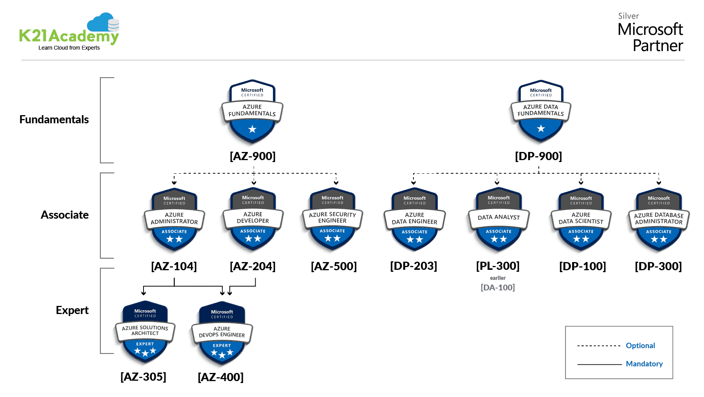

# Azure Certifications
Azure Certifications are great way to learn about the services Azure offers and how to use them alongside cloud development, DevOps, data, networking, and other subjects.

## Azure Certifications Path

*Source https://k21academy.com/microsoft-azure/certification-path/*

## Recommended Certifications
Below are the exams I have both taken and recommend:
- AZ-900: Azure Fundamentals
- DP-900: Data Fundamentals
- AZ-104: Azure Administrator
- AZ-305: Azure Solutions Architect

## Azure Certifications FAQ
### Should I tak the exam online or at a test center?
You should take the exam at a testing center. The software to take a test online can be over aggressive and cause issues during your test. If there is a technical issue at a testing center, there are trained professionals to assist you getting past any issues.

Additionally, testing centers will ensure that there are no distractions to help you focus on the exam.

### Should I take the Azure Fundamentals certification?
Yes, if this is your first Azure exam. Although the Azure Fundamentals exam is mostly marketing materials for Azure and Cloud development, there are still some reasons that this is worth your time and money.

1. Non-technical: This exam is non-technical, allowing anyone to be able to learn about Azure and achieve a cloud certification.
1. Exam format: The way you enter your answers changes every single question. You could encounter single-select, multi-select, drag-and-drop, dropdown, or other interfaces for answering questions. It's confusing and using a low-risk exam to learn how to answer questions can be good practice for the more intensive exams.
1. Time or Money Commitment: This is a cheaper, and less involved exam that can be passed relatively easily and cheaply if you are looking for a quick turnaround that doesn't impact your wallet.

### Which should I take? The Azure Administrator, or the Azure Developer?
You should take the Azure Administrator because the subjects in the exam will be encountered by every cloud developer. Azure Resource offerings, identity, governance, and permissions are all topics with which every cloud developer should be familiar.

The Azure Developer exam has an emphasis on niche, Azure specific tooling that you may not encounter at all in cloud development.
