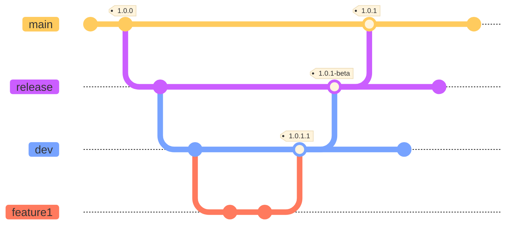

# Code Flow

# GitFlow

```mermaid
%%{
    init: {
        'logLevel': 'debug',
        'theme': 'base',
        'gitGraph': {
            'showBranches': true,
            'showCommitLabel': false
        }
    }
}%%
gitGraph
    commit
    commit tag: "1.0.0"
    branch release
    checkout release
    commit
    branch dev
    checkout dev
    commit
    branch feature1
    checkout feature1
    commit
    commit
    checkout dev
    merge feature1 tag: "1.0.1.1"
    checkout release
    merge dev tag: "1.0.1-beta"
    checkout main
    merge release tag: "1.0.1"
    checkout dev
    commit
    checkout release
    commit
    checkout main
    commit
```

# Trunk Based Development