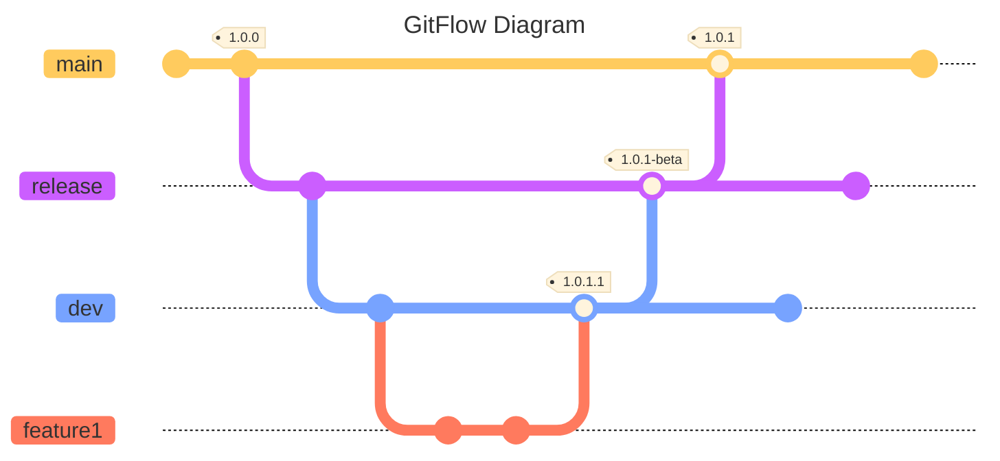

# Code Flow

# GitFlow
Gitflow is a strategy that has separate branches for different environments. Typically `main` will release to a production environment, `release` branches will release to a staging / uat / demo environment, and `dev` will release to a development environment.

# Trunk Based Development