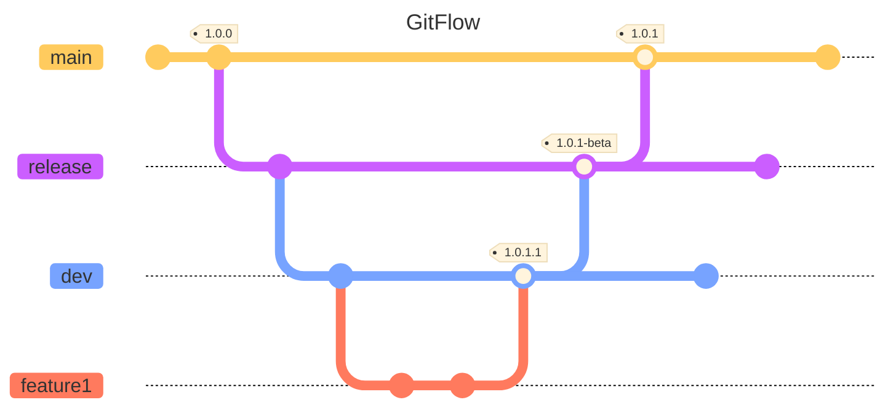
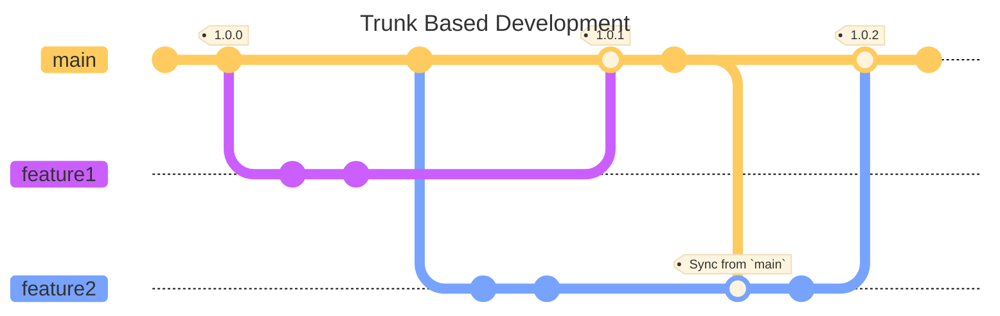

# Code Flow

# GitFlow
Gitflow is a strategy that has separate branches for different environments. Typically `main` will release to a production environment, `release` branches will release to a staging / uat / demo environment, and `dev` will release to a development environment.

## GitFlow Diagram

## Branch Types
### Feature
Developers use feature branches to create new features or create fixes.

These branches are branched off of dev and merged back to dev.

### Development
Development branches are usually named `dev` or `development`. The purpose of these branches is to have the latest code that has been checked in by the team.

### Release
Release branches are either numbered (e.g. v1.0.0, B1R2) or given release names (e.g. beta, release4).

### Production
Production branches are

# Trunk Based Development
Trunk Based Development (TBD) pairs well with Feature Flagging and Shift Left methodology. Short-lived feature branches are created from `main` and merged back to `main`.

## Trunk Based Development Diagram

## Branch Types
### Trunk
Trunk branches can be named `main` or `dev`. All deployments are based off of this branch. All other branches in the repo will have this trunk as their parent directly or indirectly.

### Feature
These are short-lived branches to create a new feature or bugfix. The purpose of these branches is to create new features for an application. They can be joint branches if utilizing pair programming, but most of the time will be specific to an individual developer.

## Feature Flagging
Feature Flagging is the practice of putting new or updated logic inside of a conditional that can be turned on at will. This separates deployments from making new features available to customers.

### Feature Flagging Options
#### Database Table
Creating a database table is a cheap, quick and dirty method for enabling feature flagging in your solution. It's unsophisticated and only allows for the feature to be enabled / disabled per environment.

#### Ad Hoc Solution
You can create your own solution to feature flag that would add more advanced feature flagging features. This has the advantage of doing exactly what you need to do, exactly the way you want to do it. This has the downside of being another system to maintain and develop if new features are required.

#### Azure App Config
If you are using Azure, App Config is a cloud hosted solution that can still be used for local development. It's a great plug-n-play option if you do not want to create your own feature flagging solution.

#### Launch Darkly
Launch Darkly is a SAAS service that offers advanced feature flagging capabilities but is still easy to use. It has a vast array of flagging capabilities and integrations. If you need the widest range of capabilities for your feature flagging solution, this is the product that I would recommend.
