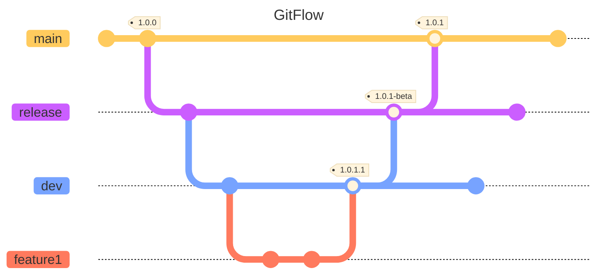
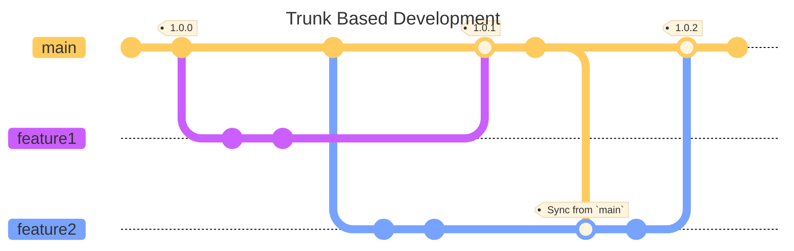

# Code Flow

# GitFlow
Gitflow is a strategy that has separate branches for different environments. Typically `main` will release to a production environment, `release` branches will release to a staging / uat / demo environment, and `dev` will release to a development environment.

## GitFlow Diagram

## Branch Types
### Feature
Developers use feature branches to create new features or create fixes.

These branches are branched off of dev and merged back to dev.

### Development
Deveopment branches are usually named `dev` or `development`. The purpose of these branches is to have the latest code that has been checked in by the team.

### Release
Relase branches are either numbered (e.g. v1.0.0, B1R2) or given release names (e.g. beta, release4).

### Production
Production brnahces aer 

# Trunk Based Development
Trunk Based Development (TBD) pairs well with Feature Flagging and Shift Left methodology. Short-lived feature branches are created from `main` and merged backe to `main`.

## Trunk Based Development Diagram

## Branch Types
### Trunk
Trunk branches can be named `main` or `dev`. All deployments are based off of this branch.

### Feature
These are short-lived branches to create a new feature or bugfix.