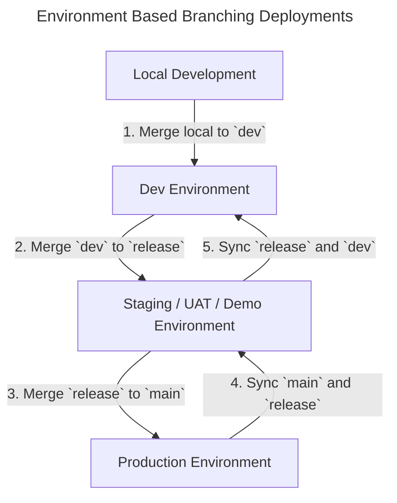

# Deployment Flows

# Environment Based Branching

```mermaid
---
title: Environment Based Branching Deployments
---

%%{
    init: {
        'theme':'default'
    }
}%%

flowchart TD
    local[Local Development] -- 1. Merge local to `dev` --> dev[Dev Environment]
    dev -- 2. Merge `dev` to `release` --> release[Staging / UAT / Demo Environment]
    release -- 3. Merge `release` to `main` --> prod[Production Environment]
    prod -- 4. Sync `main` and `release` --> release
    release -- 5. Sync `release` and `dev` --> dev
```