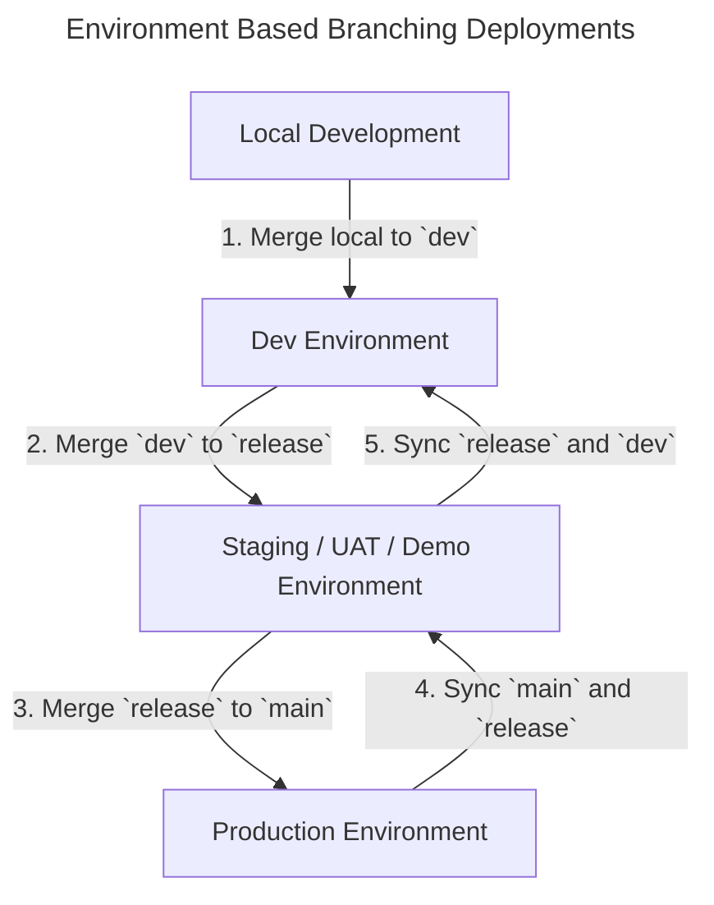

# Deployment Flows

# Environment Based Branching
Environment Based Branching has a 1:1 relationship between a Git branch and a deployed environment. When you want to deploy changes to a different environment, you merge changes from one git branch into another.

# Example Deployment Flow Diagram

# Trunk Based Deployments
Trunk based deployments is a great method to make sure the branch that is the source of truth for commits, is also the source of the deployments to multiple environments.
